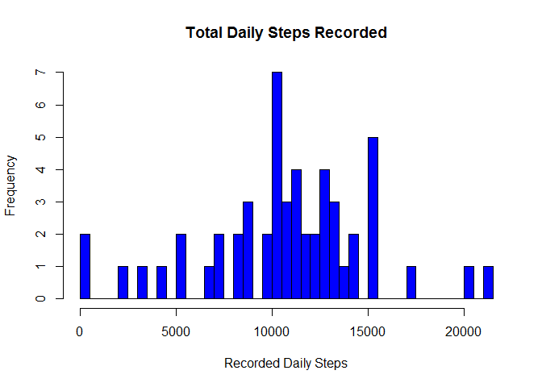
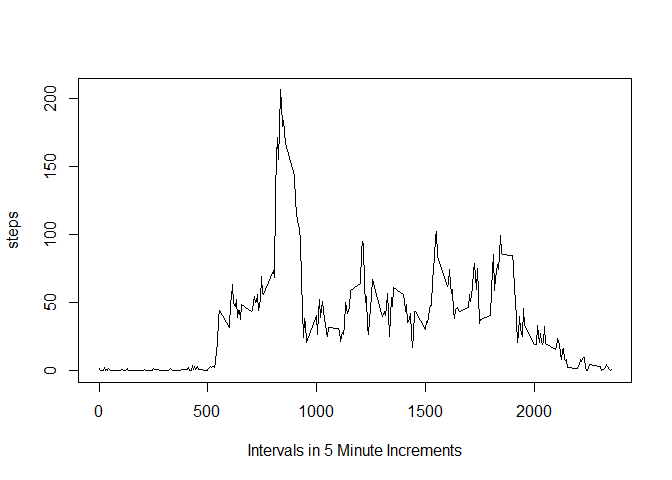
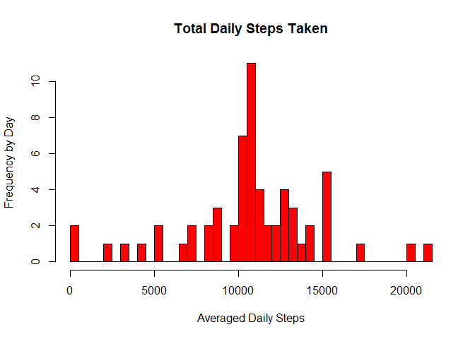
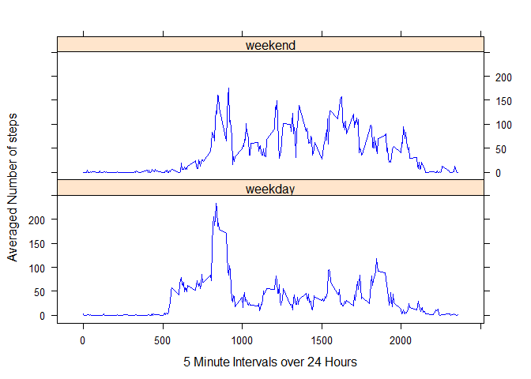

# Reproducible Research: Peer Assessment 1


## Loading and preprocessing the data
###1. Reading the data from the current directory.

```r
activity.df<- read.csv(unz('./activity.zip','activity.csv'))
```
###2. Transform the date column into a suitable R format and review.


```r
 activity.df$date <- as.Date(activity.df$date)
 head(activity.df)
```

```
##   steps       date interval
## 1    NA 2012-10-01        0
## 2    NA 2012-10-01        5
## 3    NA 2012-10-01       10
## 4    NA 2012-10-01       15
## 5    NA 2012-10-01       20
## 6    NA 2012-10-01       25
```
 
## What is mean total number of steps taken per day?
###1. Ignoring days with missing values, calculate the number of steps taken daily and review.

```r
 dailysteps <- aggregate(steps ~ date, activity.df, sum)
 colnames(dailysteps) <- c('date', 'steps')
 head(dailysteps)
```

```
##         date steps
## 1 2012-10-02   126
## 2 2012-10-03 11352
## 3 2012-10-04 12116
## 4 2012-10-05 13294
## 5 2012-10-06 15420
## 6 2012-10-07 11015
```

###2. Create a histogram of the total number of steps taken each day that has a recorded value.

```r
 hist(dailysteps$steps, main = "Total Daily Steps Recorded", xlab = "Recorded Daily Steps", ylab = "Frequency", breaks=53, col='blue')
```

 

###3. Calculate and report the mean and median of the number of steps taken daily from the above dataset.
Days with the value of NA for steps were not included in the analysis.

```r
 dailysteps_mean <- mean(dailysteps$steps)
 print(dailysteps_mean)
```

```
## [1] 10766.19
```

```r
 dailysteps_median <- median(dailysteps$steps, na.rm=FALSE)
 print(dailysteps_median)
```

```
## [1] 10765
```

## What is the average daily activity pattern?
###1. Make a time series plot (type="1") of the 5-minute interval(x-axis) and the average steps taken, averaged across all days (y-axis).

```r
intervalsteps <- aggregate(steps  ~  interval, data = activity.df, FUN = mean, rm.na = TRUE)
plot(intervalsteps, type = "l", xlab = "Intervals in 5 Minute Increments")
```

 

```r
head(intervalsteps)
```

```
##   interval     steps
## 1        0 1.7169811
## 2        5 0.3396226
## 3       10 0.1320755
## 4       15 0.1509434
## 5       20 0.0754717
## 6       25 2.0943396
```

###2. Which 5-minute interval, on average across all the days in the dataset, contains the maximum number of steps?

```r
intervalsteps$interval[ which.max(intervalsteps$steps)]
```

```
## [1] 835
```

## Imputing missing values
###1. Calculate and report the total number of missing values in the dataset(i.e. the total number of rows with NA).

```r
sum(is.na(activity.df$steps))
```

```
## [1] 2304
```

###2. Devise a strategy for filling in all of the missing values in the dataset. The strategy does not need to be sophisticated. For example, you could use the mean/median for that day, or the mean for that 5-minute interval, etc.

To fill in the missing values, we can replace the NA by using the mean of the interval in the dataset by merging the original dataset with the average daily pattern dataset.

###3. Create a new dataset that is equal to the original dataset but with the missing data filled in.


```r
#merge the original dataset with the average interval datastep from the average daily pattern question.
na_activity <- merge(activity.df, intervalsteps, by = "interval", suffixes = c("",".y"))

#Create a vector that identifies the na values (true/false statements).
na <- is.na(na_activity$steps)

#Replace all the na with the average values from the daily pattern dataset (intervalsteps).
na_activity$steps[na]<- na_activity$steps.y[na]

#Remove the intervalsteps column and limit the report to only the first 3 columns.
na_activity <- na_activity[ , c(1:3)]

#Review the dataset.
head(na_activity)
```

```
##   interval    steps       date
## 1        0 1.716981 2012-10-01
## 2        0 0.000000 2012-11-23
## 3        0 0.000000 2012-10-28
## 4        0 0.000000 2012-11-06
## 5        0 0.000000 2012-11-24
## 6        0 0.000000 2012-11-15
```

###4.a Create a histogram of the total number of steps taken each day. Calculate and report the mean and median total number of steps taken per day. 


```r
totalsteps <- aggregate( steps ~ date, data = na_activity, sum)
hist(totalsteps$steps, main = "Total Daily Steps Taken", xlab = "Averaged Daily Steps", ylab = "Frequency by Day", breaks=53, col='red')
```

 

```r
mean(totalsteps$steps)
```

```
## [1] 10766.19
```

```r
median(totalsteps$steps)
```

```
## [1] 10766.19
```

###4.b Do the mean and median values differ from the estimates from the first part of the assignment? What is the impact of imputing missing data on the estimaes of the total daily number of steps? 

While using the mean to replace the na's in the data set has little impact on the mean and median value for this particular assignment, it does impact the graphical presentation of the data. In the first data set assignment, there were only 3 days where the participant had 10500 to 11000 steps. In the second assginment, there were more than 10 days of 10500 to 11000 steps. 

## Are there differences in activity patterns between weekdays and weekends?
###1. Create a new factor variable in the dataset with two levels - "weekday" and "weekend" indicating whether a given date is a weekday or weekend day.


```r
activity.df$day <- as.factor(ifelse(weekdays(activity.df$date)=='Saturday' | weekdays(activity.df$date)=='Sunday', 'weekend', 'weekday'))

str(activity.df)
```

```
## 'data.frame':	17568 obs. of  4 variables:
##  $ steps   : int  NA NA NA NA NA NA NA NA NA NA ...
##  $ date    : Date, format: "2012-10-01" "2012-10-01" ...
##  $ interval: int  0 5 10 15 20 25 30 35 40 45 ...
##  $ day     : Factor w/ 2 levels "weekday","weekend": 1 1 1 1 1 1 1 1 1 1 ...
```

```r
head(activity.df)
```

```
##   steps       date interval     day
## 1    NA 2012-10-01        0 weekday
## 2    NA 2012-10-01        5 weekday
## 3    NA 2012-10-01       10 weekday
## 4    NA 2012-10-01       15 weekday
## 5    NA 2012-10-01       20 weekday
## 6    NA 2012-10-01       25 weekday
```

###2. Make a panel plot containing a time series plot (i.e. type = "l") of the 5-minute interval (x-axis) and the average number of steps taken, averaged across all weekday days or weekend days (y-axis). See the README file in the GitHub repository to see an example of what this plot should look like using simulated data.


```r
library(lattice)
activityaveraged <- aggregate (steps ~ interval + day, data=activity.df, FUN=mean)

xyplot(steps ~ interval | day, activityaveraged,
       type="l", 
       layout=c(1,2),
       lwd=1, 
       xlab="5 Minute Intervals over 24 Hours", 
       ylab="Averaged Number of steps",
       col="blue") 
```

 


 


                             
